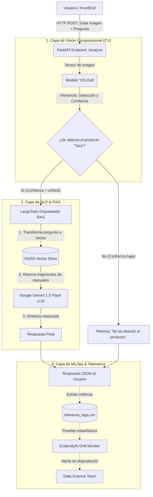

# 🤖 Asistente Inteligente de Inventario y Manuales (MVP)

Este proyecto es un **Producto Mínimo Viable (MVP)** diseñado para demostrar un flujo *End-to-End* de Machine Learning y Operaciones de IA (MLOps). Combina Visión por Computadora (CV) y Procesamiento de Lenguaje Natural (NLP) a través de una arquitectura RAG (Retrieval-Augmented Generation).

---

## 🏗️ Arquitectura del Sistema

El núcleo de la solución es una API construida con **FastAPI**, la cual orquesta un pipeline complejo de dos fases: Visión Artificial y Procesamiento de Lenguaje Natural (NLP). El objetivo de esta arquitectura es validar visualmente el contexto antes de proporcionar asistencia técnica.



### Explicación Detallada de los Componentes

#### 1. Capa de Visión Computacional (Filtro Visual)
Antes de responder cualquier pregunta técnica, el sistema debe confirmar que el usuario está operando el producto correcto. 
- Utilizamos **YOLOv8** (You Only Look Once), un modelo de estado del arte en detección de objetos en tiempo real. 
- Fue entrenado de manera supervisada usando un conjunto de datos (aumentado geométricamente) gestionado a través de **Roboflow**. 
- Si la imagen recibida no contiene una "Taza" (nuestro producto de inventario) con una confianza matemática predefinida, la petición se cancela. Esto ahorra cuotas (costos) de la API del LLM y evita alucinaciones del asistente.

#### 2. Capa NLP con Arquitectura RAG
Si el objeto es validado, el flujo ingresa a la capa semántica:
- **Indexación Offline:** Los manuales técnicos en PDF (ej. instrucciones de cuidado) son procesados por LangChain. Se dividen en fragmentos lógicos (*Chunking*) y se convierten en vectores matemáticos usando **Embeddings de HuggingFace** (`all-MiniLM-L6-v2`). Estos se almacenan en una base de datos vectorial local (**FAISS**).
- **Recuperación y Generación (Online):** La pregunta del usuario se vectoriza. FAISS calcula la distancia espacial (Similitud del Coseno) y recupera los párrafos exactos del manual que responden a la consulta. Estos párrafos se inyectan como "contexto estricto" al LLM (**Google Gemini**), obligándolo a responder basándose única y exclusivamente en los manuales de la empresa.

#### 3. Capa de Telemetría (MLOps)
Los modelos de Machine Learning sufren de "Model Decay" (degradación) cuando el mundo exterior cambia. 
- Cada inferencia (predicción) que ocurre en la API registra métricas críticas (como el puntaje de confianza de YOLO o la longitud del texto) de forma asíncrona en un archivo `.csv`.
- Mediante **EvidentlyAI**, ejecutamos análisis estadísticos (pruebas de deriva) comparando los datos en producción con un "Baseline" (histórico sano). Si los usuarios empiezan a subir imágenes de baja calidad y el modelo YOLO pierde confianza generalizada (*Data Drift*), el sistema alerta automáticamente para iniciar un re-entrenamiento.

## ✨ Características Principales

1. **Visión Computacional:** Un modelo `YOLOv8` entrenado a medida utilizando **Ultralytics** y datos sintéticos aumentados desde **Roboflow**. Identifica la presencia de productos de inventario (en este caso, tazas) con alta precisión.
2. **Q&A sobre Manuales (RAG):** Integración de **LangChain** y **Google Gemini API** para que el sistema responda preguntas basándose exclusivamente en manuales técnicos vectorizados localmente mediante **FAISS** y embeddings de HuggingFace.
3. **Monitoreo de Data Drift:** Implementación de **EvidentlyAI** para generar dashboards automáticos que alertan cuando los datos de producción varían significativamente respecto a los datos de referencia (entrenamiento).
4. **Despliegue y DevOps:** Contenedores construidos con **Docker**, orquestación local con `docker-compose`, y automatización de pruebas CI/CD mediante **GitHub Actions**.

---

## 🚀 Cómo ejecutar el proyecto

Existen dos formas principales de arrancar la aplicación:

### Opción 1: Con Docker (Recomendado)
Asegúrate de tener instalado Docker y Docker Compose, además de proveer tu `GEMINI_API_KEY`.

```bash
# 1. Clonar el repositorio
git clone https://github.com/fernando-pedernera/asistente-inventario-ia.git
cd asistente-inventario-ia

# 2. Configurar variables de entorno
# Renombra .env.example a .env e inserta tu clave de Google Gemini API
cp .env.example .env

# 3. Levantar los contenedores
docker-compose up --build
```
La API estará expuesta en `http://localhost:8000`. Puedes probar el endpoint interactivo en `http://localhost:8000/docs`.

### Opción 2: Ejecución Local en Python (Modo Desarrollo)
Asegúrate de tener Python 3.10+ y un entorno virtual configurado.

```bash
# Instalar requerimientos y librerías del sistema para OpenCV
pip install -r requirements.txt

# Iniciar servidor Uvicorn
uvicorn src.api.main:app --reload
```

---

## 📂 Estructura del Repositorio

```text
├── .github/workflows/   # Pipelines de CI/CD (GitHub Actions)
├── data/
│   ├── raw/             # Datos crudos (Imágenes descargadas, PDFs originales)
│   └── processed/       # Datos procesados y Logs de monitoreo (Evidently)
├── models/
│   └── faiss_index/     # Base de datos vectorial persistente
├── runs/                # Salidas y pesos (.pt) de entrenamiento YOLOv8
├── src/                 # Código fuente principal
│   ├── api/             # FastAPI y endpoints (main.py, test_api.py)
│   ├── data/            # Scripts de ingesta (Roboflow)
│   └── models/          # Scripts de RAG, entrenamiento YOLO y Monitoreo Drift
├── tests/               # Pruebas unitarias para CI/CD
├── .dockerignore
├── docker-compose.yml
├── Dockerfile
├── requirements.txt
└── README.md
```

## 📈 Pruebas y Monitoreo (Evidently)

El proyecto incluye un script para evaluar si los datos de entrada están sufriendo *Data Drift*. Para generar un reporte estadístico visual (HTML):

```bash
python src/models/drift_monitor.py
```
El reporte se guardará en la raíz como `drift_report.html`, mostrándote gráficas detalladas sobre las distribuciones estadísticas de las métricas registradas (longitud de preguntas, confianza de visión, etc).
